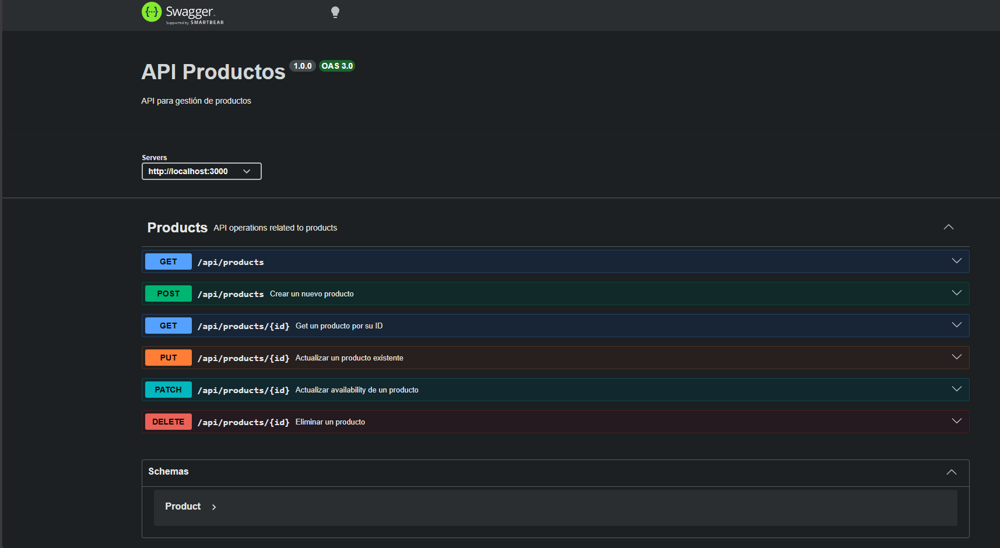

---

# Backend REST API en Node.js + TypeScript para gestionar productos

- CRUD de productos (GET, POST, PUT, PATCH, DELETE) en /api/products
- Validaciones con express-validator
- Persistencia con Sequelize (conector pg, orientado a PostgreSQL)
- Documentación de endpoints con Swagger en /docs
- Tests con Jest + Supertest

## Usa principalmente estas tecnologías y librerías:

- Node.js: runtime para ejecutar el backend.
- TypeScript: tipado estático para escribir código más seguro y mantenible.
- Express: framework para crear la API REST y definir rutas/middlewares.

## Base de datos y ORM:

- Este proyecto utiliza una base de datos PostgreSQL alojada en Render.
- PostgreSQL (pg): motor de base de datos relacional.
- Sequelize: ORM para mapear modelos y hacer operaciones CRUD sin SQL manual en la mayoría de casos.
- sequelize-typescript: integración de Sequelize con clases/decoradores de TypeScript.
- pg-hstore: dependencia auxiliar usada por Sequelize en ciertos tipos de serialización.

